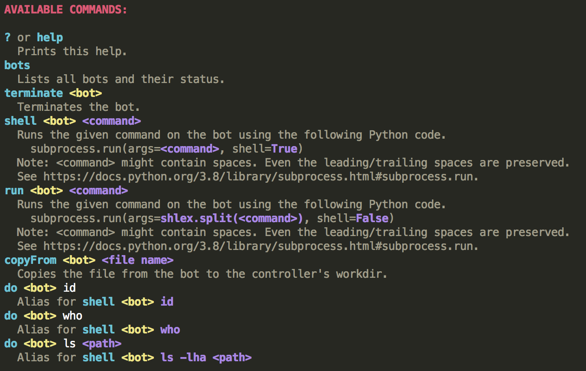

# bot

A simple Python bot and a controller that uses [gist.github.com] for communication.

❗️ **Note:** This very simple bot was created purely for learning purposes as a solution of the "Black Gate" task from
the final Stage 5 of the Bonus Assignment from the [CTU FEE][ctu-fee] ([ČVUT FEL][cvut-fel])
[BSY course][ctu-fee-bsy] (Winter 2022/2023 term).


## Content

<!-- START doctoc generated TOC please keep comment here to allow auto update -->
<!-- DON'T EDIT THIS SECTION, INSTEAD RE-RUN doctoc TO UPDATE -->

- [Background](#background)
- [Features](#features)
- [Implementation](#implementation)
- [Usage](#usage)
	- [Controller](#controller)
	- [Bot](#bot)

<!-- END doctoc generated TOC please keep comment here to allow auto update -->


## Background

The task's description from the CTFd:
> The final Stage 5 consists of only one task. You have to code a Python bot and a controller that
> uses [gist.github.com] for communication. See the attached [instructions.txt](./instructions.txt)
> file for the details.

See the [instructions.txt](./instructions.txt) for the details.


## Features

* [gist.github.com] is used for communication
* all messages between the controller and the bots are passed hidden in [the tech meme images][images-lib-gist] 🖼️
  so that communication is not (so) suspicious 🤪
* virtually unlimited number of bots 🤖
* the controller checks if the bots are alive ❤️ and maintains an up-to-date list of currently available bots
* the controller does not have to be running all the time in order for the bots to be working
* the controller allows to send commands to a selected (currently available) bot
	* `terminate` – terminate the bot
	* `shell`, `run` – an arbitrary command with arbitrary arguments can be executed on the bot (either in shell or
	  without shell), any spaces within arguments and even the command name are correctly handled and supported as well
	* `copyFrom` – copy an arbitrary file from the bot to the controller, the file name can contain spaces (it is
	  correctly handled)
* another commands to other bots can be sent while waiting on a reply for a bot
	* once the controller receives a reply to a pending command, it informs the user

<p align="center">

</p>


## Implementation

_Note: The implementation is more of a proof of a concept or demo. There are a lot of possible edge cases that we would
like to handle in real code._

The communication mechanism supports multiple bots (running on victims' machines) and one controller that is running on
the attacker's machine. Note that the controller does not have to be running all the time in order for the bots to be
working.

All messages between the controller and the bots are hidden in the images so that communication is not so suspicious.
We are using the same steganography technique that was used in Stage 3 (appending the zip-compressed data to the normal
image file).

Upon their startup, the controller and the bots download the memes library from
[this Gist][images-lib-gist]. Note that this Gist is read-only
(neither the controller nor the bots have write access).

For the actual communication, another Gist is used. ID of that Gist together with the owner's GitHub
Personal access token (classic) with (at least) `gist` scope must be provided both
to the controller and to any bot via arguments (see [Usage](#usage) section).

Both the controller and the bots periodically (currently the period is set to 30 seconds) pull the latest changes from
the communication's Gist using `git`.

TODO finish description of the implementation


## Usage

**Requirements:** (same both for the controller's machine and any bot's machine)
* Python 3.8+
* POSIX compliant system
* `zip`, `unzip`, `git`, `touch`
* network access to [gist.github.com]
* a writable working directory

**Note:** The startup order does not matter. The controller does not have to be running
in order for the bots to be working.


### Controller

The controller consists of 2 source files ([common.py](./src/common.py) and [controller.py](./src/controller.py)).
Place them in one (the same) directory.

Start the controller by running and providing at least `workdir`, `gist` and `token` positional arguments:
```bash
python3 controller.py workdir gist token
```

For a demo values of `gist` and `token` arguments, refer to Stage 5 description
in [Martin Endler BSY 2022/2023 Bonus Assignment report][report] (note: the report is shared only with the BSY course's
teachers).

You can use pass the `--help` argument to see the usage:
```text
usage: controller.py [-h] [--author AUTHOR] [--recreate] [--skip-init-reset] [--skip-init-pull] [--fast-init] workdir gist token

positional arguments:
  workdir            work directory where the files and directories created by the controller will be put
  gist               ID of the GitHub Gist for communication with bots
  token              GitHub Personal access token (classic) with (at least) gist scope

optional arguments:
  -h, --help         show this help message and exit
  --author AUTHOR    override the default git commit author (useful when you don't want to leak your global git config author value)
  --recreate         remove and recreate the workdir even if it already exists
  --skip-init-reset  skip resetting the git repos if they already exist
  --skip-init-pull   skip updating the git repos if they already exist
  --fast-init        shortcut for combination of of --skip-init-reset and --skip-init-pull
```

If you want, you can directly clone this repository and use the following command, where you have to provide only
the `gist` and `token` arguments:
```bash
python3 src/controller.py data/controller gist token
```

For a demo values of `gist` and `token` arguments, refer to Stage 5 description
in [Martin Endler BSY 2022/2023 Bonus Assignment report][report] (note: the report is shared only with the BSY course's
teachers).


### Bot

The bot consists of 2 source files ([common.py](./src/common.py) and [bot.py](./src/bot.py)).
Place them in one (the same) directory.

Start the bot by running and providing at least `workdir`, `gist` and `token` positional arguments:
```bash
python3 bot.py workdir gist token
```

For a demo values of `gist` and `token` arguments, refer to Stage 5 description
in [Martin Endler BSY 2022/2023 Bonus Assignment report][report] (note: the report is shared only with the BSY course's
teachers).

You can use pass the `--help` argument to see the usage:
```text
usage: bot.py [-h] [--author AUTHOR] [--recreate] [--skip-init-reset] [--skip-init-pull] [--fast-init] workdir gist token

positional arguments:
  workdir            work directory where the files and directories created by the bot will be put
  gist               ID of the GitHub Gist for communication with bots
  token              GitHub Personal access token (classic) with (at least) gist scope

optional arguments:
  -h, --help         show this help message and exit
  --author AUTHOR    override the default git commit author (useful when you don't want to leak your global git config author value)
  --recreate         remove and recreate the workdir even if it already exists
  --skip-init-reset  skip resetting the git repos if they already exist
  --skip-init-pull   skip updating the git repos if they already exist
  --fast-init        shortcut for combination of of --skip-init-reset and --skip-init-pull
```

If you want, you can directly clone this repository and use the following command, where you have to provide only
the `gist` and `token` arguments:
```bash
python3 src/bot.py data/bot1 gist token
```

For a demo values of `gist` and `token` arguments, refer to Stage 5 description
in [Martin Endler BSY 2022/2023 Bonus Assignment report][report] (note: the report is shared only with the BSY course's
teachers).


<!-- links references -->

[ctu-fee]: https://fel.cvut.cz/en

[cvut-fel]: https://fel.cvut.cz/cs

[ctu-fee-bsy]: https://cw.fel.cvut.cz/b221/courses/bsy/start

[gist.github.com]: https://gist.github.com/

[report]: https://docs.google.com/document/d/11WQoUg7aVeZ0qubD14JCPRX5W1x1y-dsNeIVRHi2daA/edit?usp=sharing

[images-lib-gist]: https://gist.github.com/pokusew/4c7fe7e6d06b0b90ab4848b234209e95
